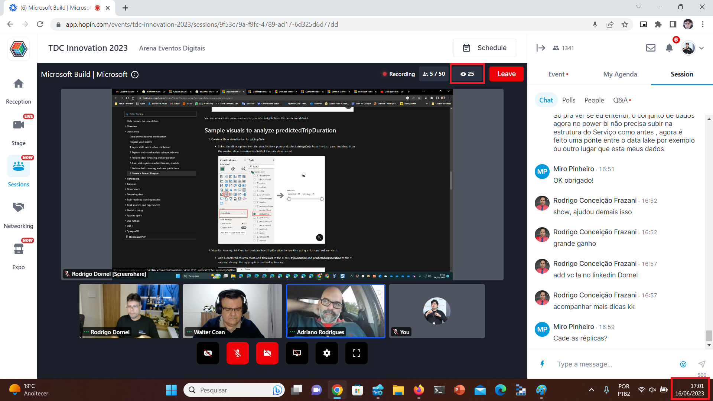
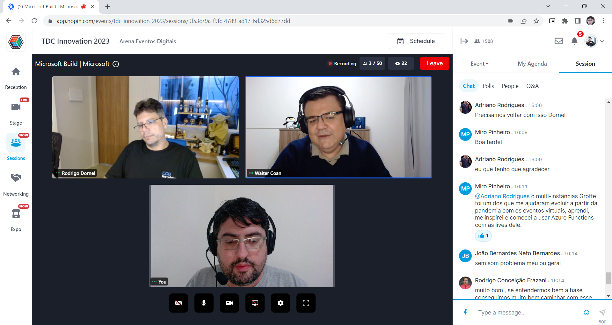
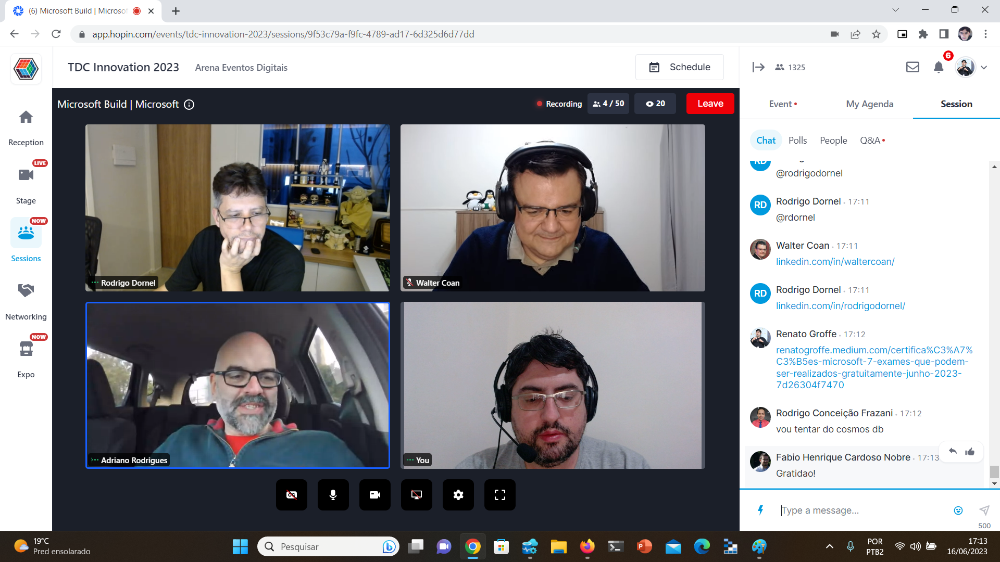
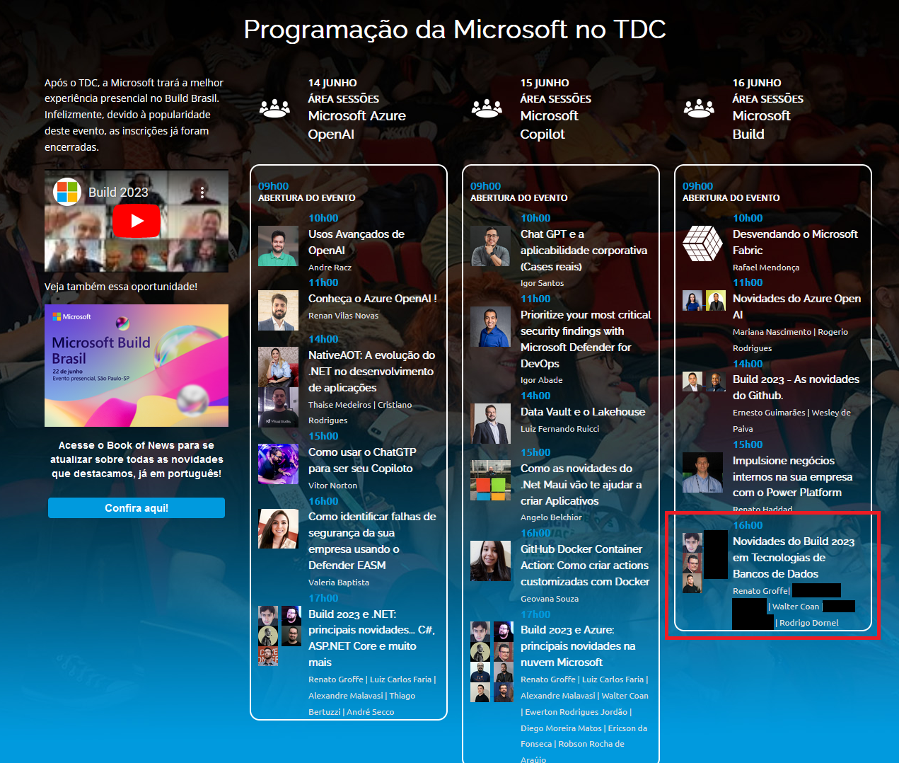

# Talk-Build2023-Data-TDC_Innovation2023
Informações (incluindo fotos + prints) sobre apresentação online abordando novidades em tecnologias de Bancos de Dados anunciadas durante a edição 2023 do Microsoft Build. Talk realizada durante o TDC Innovation 2023 no dia 16/06/2023 (sexta-feira).

Título da apresentação -> **Novidades do Build 2023 em Tecnologias de Bancos de Dados**

Página do evento: [**TDC**](https://promo.thedevconf.com/inn23-microsoft)

Público que acompanhou a apresentação: **25 pessoas** (pico de audiência ao longo da live)

Palestrantes:
- Renato Groffe (Microsoft MVP, MTAC)
- Walter Coan (Microsoft MVP)
- Rodrigo Dornel (Microsoft MVP, MTAC)

Tecnologias abordadas: **Azure SQL, Azure Cosmos DB, Microsoft Fabric**

Na pasta [**/img**](img/) estão outros prints do evento.

Deixamos aqui nossos agradecimentos ao **Adriano Rodrigues** pelo convite à comunidade **.NET São Paulo** e por todo o apoio para que participássemos como palestrantes na **Sala Microsoft**.

---

